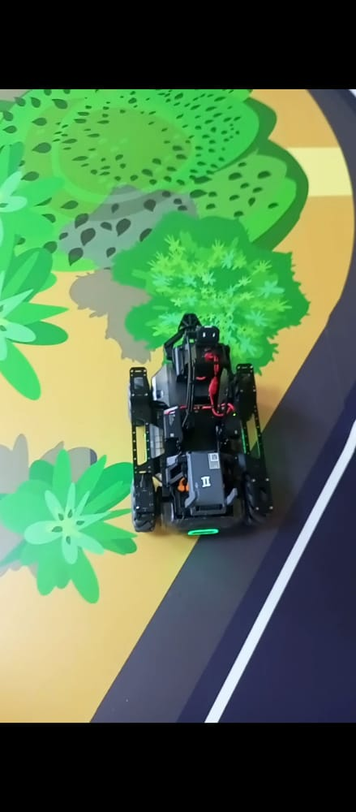

# MobileRobot-Openloopcontrol
## Aim:

To develop a python control code to move the mobilerobot along the predefined path.

## Equipments Required:
1. output EP core
2. Python 3.7

## Procedure

### Step1:
Start Program

### Step2:
Use from output import robot.


### Step3:
Choose the x,y,z - axis movement distance(meters).

### Step4:
Give ep_chassis.move to move straight.

### Step5:
Give time.sleep() for a break.

### Step6:
Give ep_chassis.drive_speed to have a circular movement.

### Step7:
End Program

## Program
```
from output import robot
import time

if __name__ == '__main__':
    ep_robot = robot.Robot()
    ep_robot.initialize(conn_type="ap")

    ep_chassis = ep_robot.chassis
    ep_led = ep_robot.led

    '''
    x = x-axis movement distance,( meters) [-5,5]
    y = y-axis movement distance,( meters) [-5,5]
    z = rotation about z axis ( degree)[-180,180]
    xy_speed = xy axis movement speed,( unit meter/second) [0.5,2]
    '''

    ep_chassis.move(x=1, y=0, z=0, xy_speed=0.85).wait_for_completed()

    ep_chassis.move(x=0, y=0, z=90, xy_speed=1).wait_for_completed()
    ep_led.set_led(comp="all",r=255,g=0,b=0,effect="on")   
    time.sleep(2)

    ep_chassis.move(x=3, y=0, z=0, xy_speed=0.85).wait_for_completed()

    ep_chassis.move(x=0, y=0, z=90, xy_speed=1).wait_for_completed()
    ep_led.set_led(comp="all",r=0,g=0,b=255,effect="on")   
    time.sleep(2)
    ep_chassis.move(x=1, y=0, z=0, xy_speed=0.85).wait_for_completed()

    ep_chassis.move(x=0, y=0, z=90, xy_speed=1).wait_for_completed()
    ep_led.set_led(comp="all",r=0,g=255,b=0,effect="on")   
    time.sleep(2)

    ep_chassis.move(x=1, y=0, z=0, xy_speed=0.85).wait_for_completed()

    ep_chassis.move(x=0, y=0, z=90, xy_speed=1).wait_for_completed()
    ep_led.set_led(comp="all",r=255,g=0,b=0,effect="on")   
    time.sleep(2)

    ep_chassis.move(x=1, y=0, z=0, xy_speed=0.85).wait_for_completed()
    ep_led.set_led(comp="all",r=0,g=255,b=0,effect="on")   
    time.sleep(2)

    ep_robot.close()

```

## MobileRobot Movement Image:





<br/>
<br/>
<br/>
<br/>

## MobileRobot Movement Video:

Upload your video in Youtube and paste your video-id here

Youtube Link :[https://youtu.be/CMOWk-B4TQg ](https://youtu.be/CMOWk-B4TQg)

<br/>
<br/>
<br/>
<br/>

## Result:
Thus the python program code is developed to move the mobilerobot in the predefined path.


<br/>
<br/>

```
Mobile Robotics Laboratory
Department of Artificial Intelligence and Data Science
Saveetha Engineering College
```
